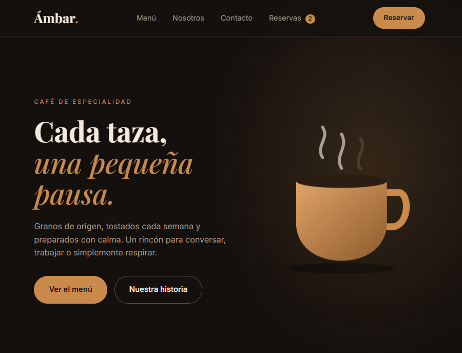
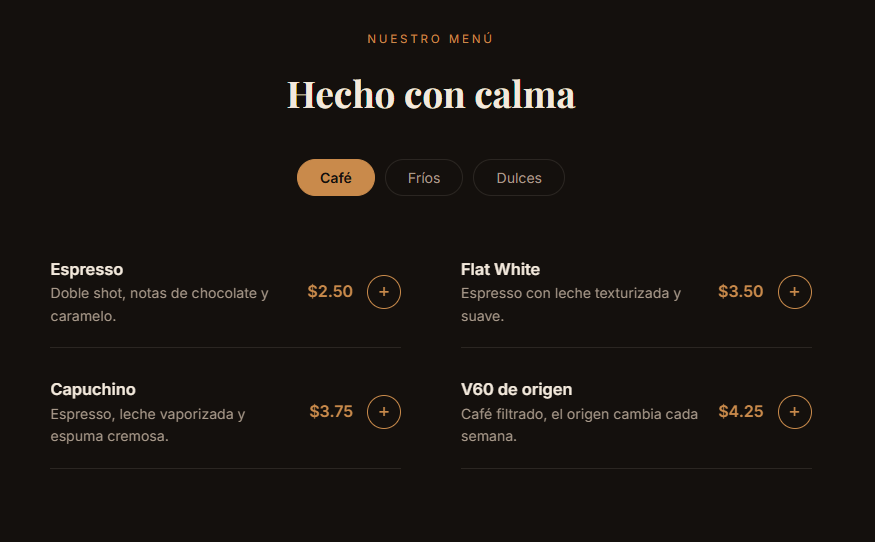
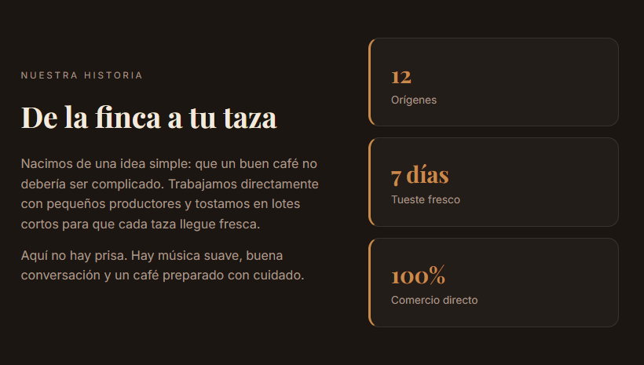
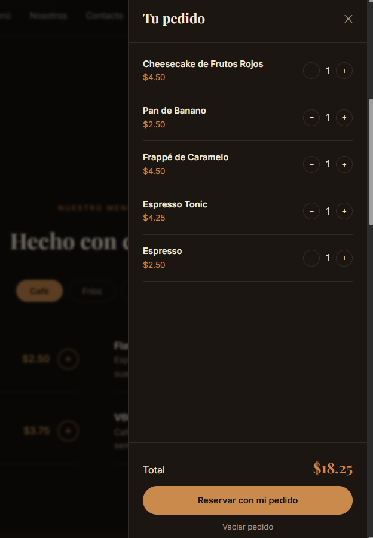
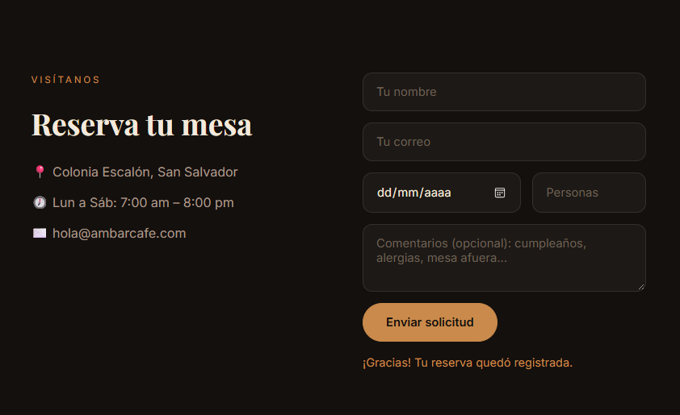

# Ámbar Café · Landing page con pedido y reservas

Landing page responsive para una cafetería de especialidad ficticia. Además de presentar el negocio, permite armar un pedido anticipado, reservar una mesa y consultar o eliminar las reservas realizadas, todo con JavaScript puro y sin librerías.

## Demo

[Ver proyecto en línea](https://jimenaturcios448.github.io/Landing_Cafe/)

## Características

- **Diseño oscuro y cálido** con paleta espresso, crema y cobre, tipografías Playfair Display e Inter.
- **Hero animado** con una taza dibujada en SVG, con vapor y movimiento suave.
- **Menú con pestañas** (Café, Fríos y Dulces) generado dinámicamente desde JavaScript.
- **Carrito de pedido** en un panel lateral: agregar productos, cambiar cantidades, vaciar y ver el total en vivo.
- **Reservas con o sin pedido**: el resumen del pedido pasa automáticamente al formulario.
- **Sección de reservas realizadas** con tarjetas ordenadas por fecha, etiquetadas como "Solo mesa" o "Con pedido".
- **Eliminar reservas** individualmente o todas a la vez, con un modal de confirmación personalizado.
- **Persistencia con localStorage**: las reservas siguen ahí al recargar la página.
- **Contador de reservas** en la barra de navegación.
- **Animaciones sutiles**: aparición al hacer scroll, barra de navegación con desenfoque y transiciones suaves.
- **Responsive**: se adapta a computadora, tablet y celular.
- **Accesibilidad**: etiquetas `aria`, cierre del panel y del modal con la tecla Escape y respeto a la preferencia "reducir movimiento" del sistema.

## Tecnologías

- HTML5
- CSS3 (variables, Grid, Flexbox, animaciones y `backdrop-filter`)
- JavaScript puro (DOM, `localStorage`, `IntersectionObserver` y promesas)

## Capturas

### Inicio



### Menú



### Nuestra historia



### Pedido



### Reserva



### Reservas realizadas


## Estructura del proyecto

```
Landing_Cafe/
├── capturas/
│   ├── inicio.png
│   ├── menu.png
│   ├── historia.png
│   ├── pedido.png
│   ├── reserva.png
│   └── reserva_realizadas.png
├── index.html
├── style.css
├── script.js
└── README.md
```

## Cómo usarlo

1. Descarga o clona el repositorio.
2. Abre `index.html` en tu navegador, o ejecútalo con la extensión Live Server de Visual Studio Code.

## Notas

- Es un **proyecto demostrativo**: no cobra pedidos ni envía correos.
- Las reservas se guardan **solo en el navegador** de cada visitante (`localStorage`), sin servidor ni base de datos.
- Los datos que escribe el usuario se muestran con `textContent`, no con `innerHTML`, para evitar la inyección de código desde el formulario.

## Posibles mejoras

- Conectar las reservas a un backend con base de datos.
- Enviar la confirmación por correo.
- Validar disponibilidad de mesas por fecha y hora.
- Agregar una galería y testimonios.

## Autora

Proyecto creado por [jimenaturcios448](https://github.com/jimenaturcios448) como parte de mi portafolio.